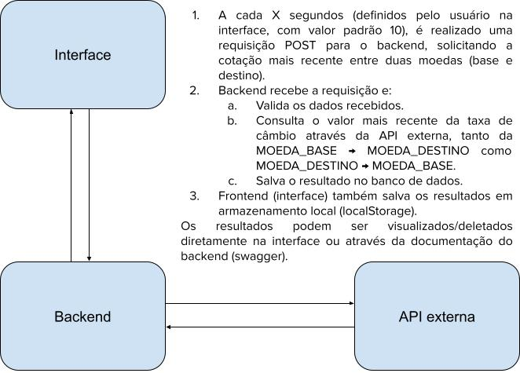
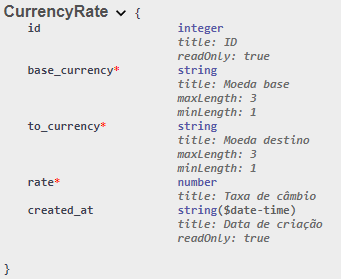

# Desafio Neurotech

Develop a service, that constantly checks the currency exchange rate from Real to US-Dollar (1 BRL = x USD). \
Requirements : \
· The check period has to be configurable \
· The results are stored in a database. The database access does not need to be fully implemented, an interface is sufficient. \
· The service has an HTTP-Resource with the following endpoints (The protocol design is up to you): \
o Get latest rate \
o Get historical rates from startDate to endDate \
· Please ensure the functionality of the business logic using unit-tests \
· The exchange rate can be taken from a public service or be mocked. \
· Please describe in a few sentences and/or with a diagram how you planned the project and architecture. \
· The project must be on Github \
· The API Must be implemented using any language, front is not necessary but it would be a icing on the cake \
· Feel free to use any library you want for this project, there are no limitations! \
This API might be helpful: <https://rapidapi.com/fixer/api/fixer-currency/>

## Arquitetura

A arquitetura do projeto foi pensada de maneira a ser escalável e de fácil manutenção.
Para isso, foi utilizado o conceito de `Docker` para a criação de containers, que facilita a execução do projeto em qualquer ambiente.
Além disso, foi utilizado o `Django` para a criação do backend, que é um framework robusto e que facilita a criação de APIs RESTful, além de utilizar a técnica de ORM (mapeamento objeto-relacional).
Para o frontend, foi utilizado o `React`, que é uma biblioteca de JavaScript/TypeScript para a criação de interfaces de usuário.

A imagem abaixo explica o fluxo principal do projeto:



A api externa para a obtenção das taxas de câmbio foi utilizada com auxílio da biblioteca [forex-python](https://pypi.org/project/forex-python/), que fornece uma API gratuita para a obtenção de taxas de câmbio.
Foi considerada também utilizar a API recomendada no escopo do desafio (<https://rapidapi.com/fixer/api/fixer-currency/>), porém ela se encontra indisponível.

### Banco de Dados

Foi utilizado o banco de dados `Postgres` para armazenar as taxas de câmbio. A escolha foi feita por ser um banco de dados robusto e que suporta grande quantidade de dados. Nenhum recurso cloud foi utilizado, o banco foi criado a partir do `Docker` e a conexão foi feita localmente.

Para este projeto, apenas uma tabela foi criada, sua modelagem pode ser vista abaixo:

```python
  ...
  id = models.BigAutoField(auto_created=True, primary_key=True, serialize=False, verbose_name='ID') # Gerado automaticamente pelo Django
  base_currency = models.CharField(max_length=3, verbose_name="Moeda base")
  to_currency = models.CharField(max_length=3, verbose_name="Moeda destino")
  rate = models.FloatField(verbose_name="Taxa de câmbio")  # Considerando o valor unitário do `base_currency`
  created_at = models.DateTimeField(auto_now_add=True, editable=False, verbose_name="Data de criação") # Gerado automaticamente pelo Django na criação do objeto
  ...
```



## Para rodar o projeto de maneira rápida e simples

Utilizando `docker` (mais especificamente `docker compose`), é possível rodar o projeto de maneira rápida e simples. Para isso, basta seguir os passos abaixo:

1. "Set" das variáveis de ambiente:

- Crie um arquivo `.env` na raíz do projeto, na raíz da pasta `/frontend` e na raíz da pasta `/backend`.
- Copie o conteúdo do arquivo `.env.default` para os arquivos `.env` criados ou baseie-se no arquivo `.env.template` para criar as variáveis de ambiente.

2. Na pasta raíz do projeto, rode o comando abaixo:

```sh
  docker compose up -d
```

Com isso, um banco de dados postgres local será criado e a interface do projeto estará rodando em <http://127.0.0.1:5173>

Para parar a aplicação, rode o comando abaixo:

```sh
  docker compose down
```

## Versões

- Python v3.12.2
- Poetry v1.8.2
- Node.js v20.12.0
- npm v10.5.0

## Desenvolvimento local

Caso deseje rodar o projeto localmente sem utilizar Docker, aqui estão as instruções.
Lembre-se de que é necessário configurar um banco de dados Postgres corretamente. Utilizando docker, tudo isso já está abstraído, e mais informações podem ser encontradas no arquivo `docker-compose.yml`, na raíz do projeto.

### Back-End

Certifique-se de que está usando a versão correta do `Python`.

#### Dependências

Veja as dependências no arquivo `./backend/pyproject.toml`.

#### Instruções

- Crie um ambiente virtual para desenvolvimento, conforme os passos abaixo:

```sh
  cd backend && virtualenv -p python3 venv && source venv/bin/activate
```

ou

```sh
cd backend && pyenv virtualenv 3.12.2 venv-name && pyenv activate venv-name
```

- Instale os pacotes necessários e os atualize para a última versão (se tiver algum problema, rode `poetry install` antes do update, mas geralmente não é necessário):

```sh
  pip install "poetry==1.8.2" && poetry update
```

- Atualize o arquivo `.env`, baseando-se no `.env.template`.

- Se for necessário atualizar sua pasta `migrations`, rode o comando abaixo:

```sh
python manage.py makemigrations --merge --no-input
python manage.py migrate --no-input
```

- Em seguida, digite a linha de comando abaixo no terminal:

```sh
  python manage.py runserver
```

- Pronto, o backend irá rodar na URL `http://localhost:8000`.

Sempre que fizer uma alteração relacionado a banco de dados (modelos, serializadores, etc), execute o comando abaixo:

```sh
  python manage.py makemigrations && python manage.py migrate
```

### Testes Unitários

Para rodar os testes unitários, digite o comando abaixo no terminal:

```sh
  python manage.py test
```

Se quiser rodar os testes de maneira mais detalhada, digite o comando abaixo:

```sh
  python manage.py test --verbosity {0,1,2,3}
```

Um aviso pode aparecer com relação a pasta `static`, mas não se preocupe, é um aviso que não interfere no funcionamento dos testes. Caso queira que ele desapareça, basta criar um arquivo vazio na pasta `static` ou rodar o comando abaixo:

```sh
  python manage.py collectstatic
```

### Front-End

Certifique-se de que está usando o `Prettier` como formatador oficial para o VsCode. Além disso, cheque as versões do seu `Node.js` e `npm`.

#### Dependências

Veja as dependências no arquivo `./frontend/package.json`.

#### Instruções

- Instale os pacotes necessários e os atualize para a última versão (se tiver algum problema, rode `npm i` antes do update, mas geralmente não é necessário):

```sh
  cd frontend
  npm update --save
```

- Atualize o arquivo `.env` (a princípio, para rodar localmente, as variáveis podem ter o mesmo valor presente em `.env.default`).

- Em seguida, digite a linha de comando abaixo no terminal:

```sh
  npm run dev
```

- Pronto, o frontend irá rodar na URL `http://localhost:5173`.

Sempre que quiser checar possíveis erros ou warnings, digite o comando abaixo no terminal:

```sh
  npm run lint
```

ou, para ajeitar os erros de formatação também:

```sh
  npm run lint-fix
```

## Troubleshoot

- Caso tenha problemas com a porta do banco de dados, cheque se a porta `5432` está sendo usada por outro serviço. Caso esteja, altere a porta nos arquivos `.env` e `backend/.env`.
- Caso tenha dificuldades em rodar o backend, por conta da variável `DJANGO_SECRET_KEY`, fale comigo diretamente ou rode o código abaixo em python e substitua o valor no arquivo `backend/.env`:

```python
  from django.core.management.utils import get_random_secret_key
  get_random_secret_key()
```

Qualquer dúvida, estou à disposição para ajudar.
